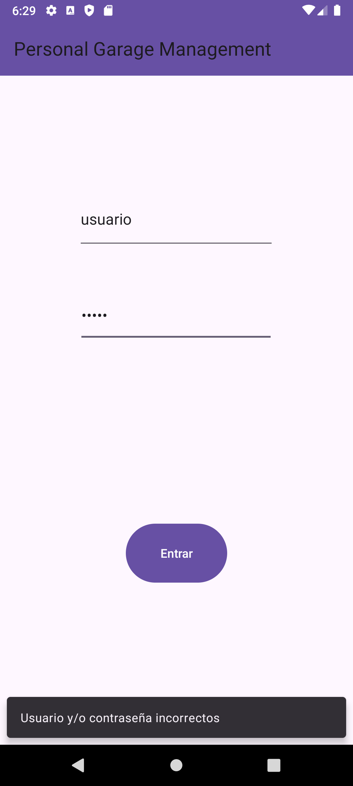
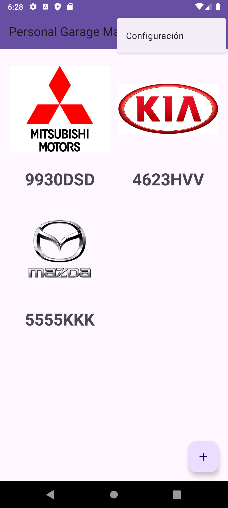
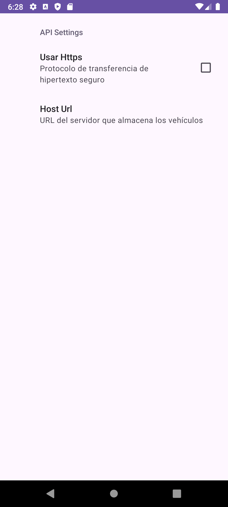
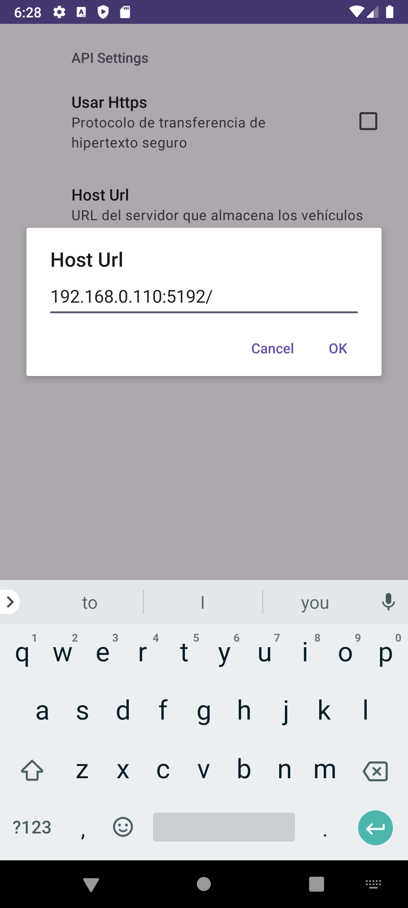
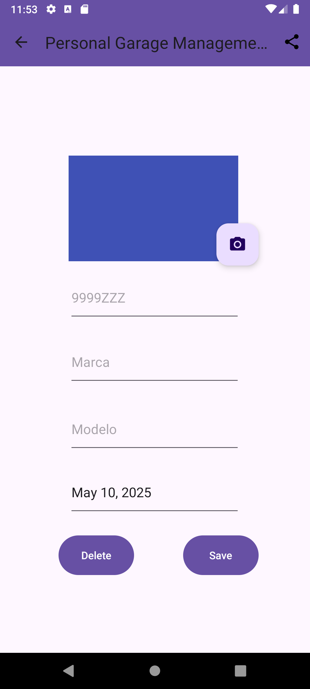
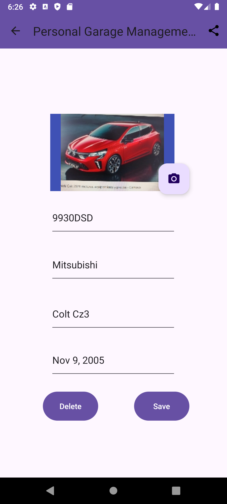
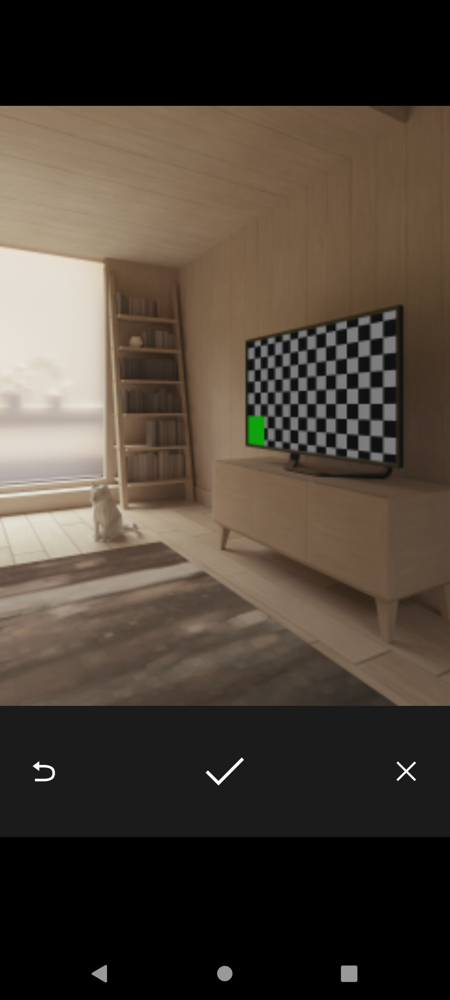
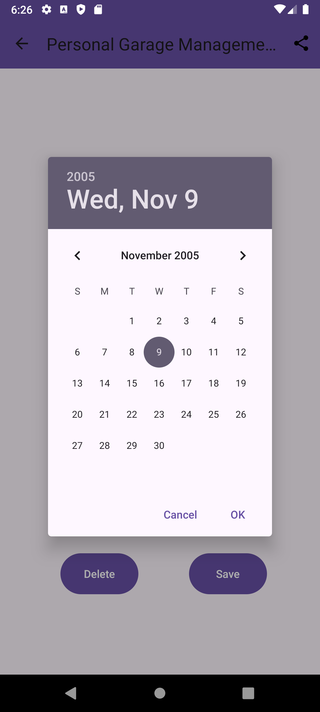
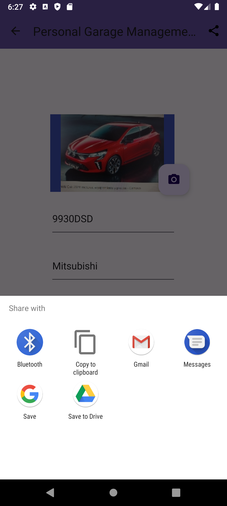
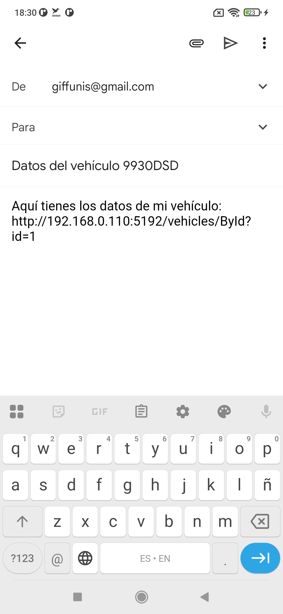

<!-- title: Personal Garage Management Manual -->
# APP móvil para gestión de vehículos

Trabajo Final  
Proyecto asignatura Dispositivos Móviles.  
Máster Universitario en Ingeniería Informática - Universidad Pablo de Olavide  

## Descripción general

Aplicación móvil nativa para Android API 28 que permite gestionar vehículos, de forma remota, gracias al uso de un [servicio externo](https://github.com/giffunis/PGM.WebApi) desarrollado para esta aplicación.  
Esta app ha sido diseñada para cumplir con los requisitos del Trabajo Final de la asignatura de Dispositivos Móviles del Master Universitario en Ingeniería Informática de la Universidad Pablo de Olavide.

## Requisitos del trabajo final

**Requisitos obligatorios**

| Requisito | Cumplimiento |  
| --------- | ------------ |  
| Varias activities (mas de 3) | Se han implementado 4 Activities: Login Activity, GarageActivity, SettingsActivity y VehicleActivity.  |  
| Variedad de componentes en la vista (Elementos que hereden de View) | Recycle View, Cuadros de diálogo, Fragments, etc. |  
| Al menos un método de Persistencia | Se utilizan 2 métodos de persistencia: La base de datos SQLite y las Shared Preferences. |  
| Notificaciones | Se utilizan dos tipos de notificaciones: Las Toast y las Snackbar. |  
| Acceso a Servicios Web y tratamiento de ficheros de intercambio de datos: XML / Json | Se consumen dos servicios: Las imágenes de las marcas de los vehículos, [Link](https://github.com/giffunis/car-logos-dataset) ; y un servicio externo [Link](https://github.com/giffunis/PGM.WebApi) desarrollado para que esta aplicación. El tipo de fichero de intercambio y procesado es, Json. Se hace uso de librerías externas como [Volley](https://github.com/google/volley) y [Gson](https://github.com/google/gson) |

**Requisitos opcionales**

| Requisito | Cumplimiento |  
| --------- | ------------ |  
| Menús | Existen 2 menú de opciones en dos activities (GarageActivity y VehicleActivity) |  
| Sharing entre apps | Se comparten, los datos del vehículo seleccionado en formato texto, a través de la App de Gmail u otra que acepte dicho formato |  
| Sensores | Cámara (necesaria para sacar fotos al vehículo) |  

 
 ## Manual de usuario
 
- [1. Acceso y Autenticación](#1-acceso-y-autenticación).
- [2. Configuración de la aplicación](#2-configuración-de-la-aplicación).
- [3. Visualización de su garaje](#3-visualización-de-su-garaje).
- [4. Visualización, creación, modificación y borrado de un vehículo](#4-visualización-creación-modificación-y-borrado-de-un-vehículo).
- [5. Compartir datos del vehículo por email](#5-compartir-datos-de-un-vehículo-por-email).

 ### 1. Acceso y Autenticación
 
 Para acceder a la aplicación, se nos solicitará las credenciales de acceso. En esta primera versión, se ha almacenado un usuario local en una tabla de SQlite:

 - Username: usuario
 - Password: 123456

***Nota**: Este método de autenticación local, se ha escogido solo por motivos académicos. La autenticación en una aplicación real sería mediante JWT tokens y el almacenamiento en las SharePreferences.

En el caso de que se introduzcan credenciales erroneas, aparecerá una notificación mediante snackbar describiendo el problema.

 

### 2. Configuración de la aplicación

En el menú de la pantalla principal, en la opción `Configuración`, accederemos a la pantalla de configuración, dónde se muestran las SharedPreferences almacenadas de la aplicación:

 

Actualmente, aparecen:

- Activación de Https.
- La Url del [servicio externo](https://github.com/giffunis/PGM.WebApi) desarrollado para esta aplicación.

 ### 3. Visualización de su garaje

En la pantalla principal se cargarán los vehículos que el usuario tenga registrados. El origen de dicha información es el [servicio externo](https://github.com/giffunis/PGM.WebApi) desarrollado para esta aplicación y configurado en la sección anterior.

En ella, vemos los siguientes elementos:

- Recicle View - Muestra el listado de vehículos registrados.
- BAF (Floatin Action Button) - Botón para añadir nuevos vehículos.
- Menu:
  - Refresh icon - Para actualizar el listado.
  - Settings icon - Para modificar parámetros de ajuste de la apliación.

### 4. Visualización, creación, modificación y borrado de un vehículo

Para ver, editar o eliminar un vehículo, pulsamos sobre el mismo. Para añadir uno nuevo, pulsaremos sobre el BAF correspondiente. Esto nos abrirá la pantalla de detalle del propio vehículo (Vehicle Activity), vacía en el caso de la creación.

 

En ella, vemos los siguientes datos:

- Imagen del vehículo.
- BAF para sacar una nueva captura.
- Matrícula.
- Marca.
- Modelo.
- Año de matriculación.

***Nota:** No se han puesto encabezados en los campos porque se han configurado los textos de sugerencia (hint text).

Como se aprecia en la imagen, existen dos botones: el botón de guardado, que almacena los cambios realizados, y el botón para eliminar. En ambos casos, aparecerá una notificación mediante Toast, con el resultado de la acción.

#### 3.1 Captura del vehículo

Si queremos sacar una foto a nuestro vehículo, pulsamos sobre el BAF correspondiente y se abrirá la cámara:

#### 3.2 Fecha de matriculación

Para facilitar el registro de la fecha de matriculación, se ha usado un cuadro de diálogo (DatePicker).

### 5. Compartir datos de un vehículo por email

La aplicación ofrece la posibilidad de compartir toda la información del vehículo por email (ideal cuando se va a contratar un seguro o cuando se quiere vender el vehículo a un tercero). Para ello, se hace uso del Sharing entre apps. Basta con hacer clic en el icono de compartir del menú del vehículo:

y seleccionar la aplicación de Gmail. A continuación, se creará un borrador con la siguiente información:

- Asunto: *Datos del vehículo `matrícula`*
- Cuerpo del mensaje: Enlace al servicio externo con los datos del vehículo (La página para visualizar esta información en el servicio externo no ha sido aún desarrollada. La información se puede consultar vía API REST).

