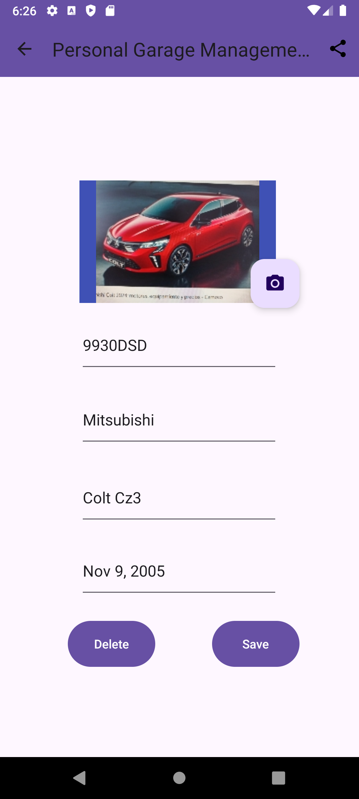
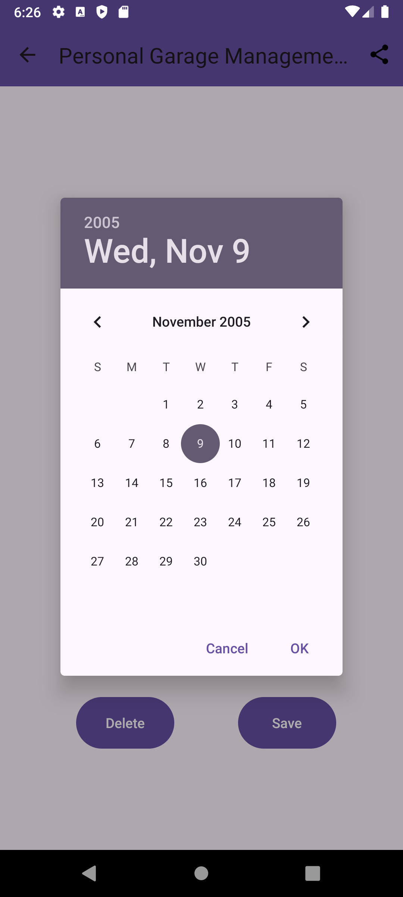

 # Personal Garage Management
 
 ## Índice
 
- [1. Acceso y Autenticación](###1.-Acceso-y-Autenticación).
- [2. Visualización de su garaje](##2.-Visualización-de-su-garaje).

 ### 1. Acceso y Autenticación
 
 Para acceder a la aplicación, se nos solicitará las credenciales de acceso. En esta primera versión, se ha almacenado un usuario local en una tabla de SQlite:

 - Username: usuario
 - Password: 123456

***Nota**: Este método de autenticación local, se ha escogido solo por motivos académicos. La autenticación en una aplicación real sería mediante JWT tokens y el almacenamiento en las SharePreferences.

En el caso de que se introduzcan credenciales erroneas, aparecerá una notificación mediante snackbar describiendo el problema.

 

 ### 2. Visualización de su garaje

En la pantalla principal se cargarán los vehículos que el usuario tenga registrados. El origen de dicha información es el [servicio externo](https://github.com/giffunis/PGM.WebApi) desarrollado para que esta aplicación.

 

#### 2.1 Elementos

- Recicle View - Muestra el listado de vehículos registrados.
- BAF (Floatin Action Button) - Botón para añadir nuevos vehículos.
- Menu:
  - Refresh icon - Para actualizar el listado.
  - Settings icon - Para modificar parámetros de ajuste de la apliación.

### 3. Visualización, modificación o borrado de un vehículo

Para ver, editar o eliminar un vehículo, pulsamos sobre el mismo. Esto nos abrirá la pantalla de detalle del propio vehículo (Vehicle Activity)

 

En ella, vemos los siguientes datos:

- Imagen del vehículo.
- BAF para sacar una nueva captura.
- Matrícula.
- Marca.
- Modelo.
- Año de matriculación.

***Nota:** No se han puesto encabezados en los campos porque se han configurado los textos de sugerencia (hint text).

Como se aprecia en la imagen, existen dos botones: el botón de guardado, que almacena los cambios realizados, y el botón para eliminar. En ambos casos, aparecerá una notificación mediante Toast, con el resultado de la acción.

#### 3.1 Captura del vehículo

Si queremos sacar una foto a nuestro vehículo, pulsamos sobre el BAF correspondiente y se abrirá la cámara:

#### 3.2 Fecha de matriculación

Para facilitar el registro de la fecha de matriculación, se ha usado un cuadro de diálogo (DatePicker).

